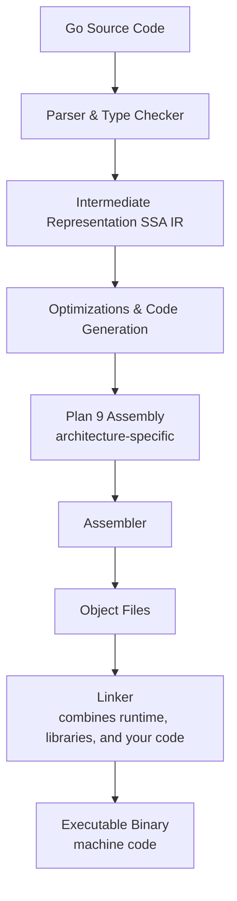

# Go Language Complete Guide

## Overview

Go is a compiled, statically typed, general-purpose programming language designed for system programming (excluding firmware). It is known for its fast compilation times, simplicity, and suitability for cloud-native applications.

### Key Features

- **Compiled & Statically Typed:** Ensures type safety and performance.
- **General Purpose:** Suitable for a wide range of applications.
- **Fast Compilation:** No preprocessing or macros; uses snapshot-based compilation.
- **Simplicity:** Only 25 keywords, making it easy to learn.
- **Garbage Collection:** Automatic memory management.
- **No External Runtime Required:** Produces static binaries with built-in runtime, resulting in low memory usage and fast startup—ideal for cloud environments.
- **Cross-Compilation:** Easily build executables for Linux, Windows, and Mac from any platform.
- **Concurrency Support:** Built-in primitives for concurrent programming.
- **Distinct Error Handling:** Errors are treated as values.
- **Hybrid Paradigm:** Not purely object-oriented or procedural.
- **Static Linking:** All dependencies are included in the final build.

## Go Compilation Process



## Basic CLI Commands and Syntax

```bash
# Initialize a new module
go mod init <module-name>
```

```bash
# Build the Go program in the current directory:
go build <file_name.go>
```

```bash
# Build the program with optimizations
go build -ldflags="-s -w" -o <output_file> <file_name.go>
```

```bash
# Go Environment
go env
```

#### Go Cross compilations

```bash
GOOS=linux && GOARCH=amd64 go build -o myapp-linux-amd64 main.go
```

```
# Go supported architectures
go tool dist list
```

```bash
### This bash command runs a Go program with the `-gcflags="-m"` option, which instructs the Go compiler to print optimization decisions, such as inlining and escape analysis. Replace `your_program.go` with the name of your Go source file to analyze how the Go compiler optimizes your code.

go build -gcflags="-m" your_program.go
```
